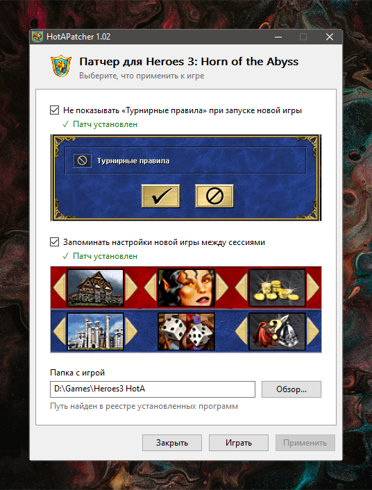

#  HotAPatcher

 

Утилита патчит игру [Heroes 3: Horn of the Abyss](https://h3hota.com), чтобы уменьшить рутину при запуске новой сессии.

## Описание

Я играю в основном локальные сессии на случайных картах, и два момента меня раздражали.

**Окно «Турнирные правила»** появляется каждый раз при запуске новой игры, независимо от того, включены турнирные правила или нет. Отключить его нельзя ни твиками HD-мода, ни как-то ещё. Патч убирает этот лишний клик.

**Настройки новой игры не запоминаются**. Список городов приходится выставлять заново каждый раз. Полный случайный выбор мне не подходит, потому что есть города и их биомы, которые я не люблю. Пропатченная игра теперь будет сохранять выбранные города, героя и стартовый бонус, между сессиями. Сохранённые значения заполняются только если они доступны на выбранной карте. Игра хранит их в файле `HotA_Patcher.dat`, если его удалить сохранение сбросится.

## Как пользоваться

1. Убедиться, что игра не запущена.
2. Запустить `HotAPatcher.exe`, желательно от имени администратора.
3. Путь к игре подставится автоматически, если она была установлена. Иначе указать папку вручную.
4. Отметить нужные галочки и нажать «Применить».

Оригиналы перезаписываемых файлов сохраняются, отмена патча просто восстанавливает их.

## После обновления

Обновление HotA и HD-мода может перезаписать патченные файлы `HD_HOTA.dll`, `h3hota.exe` и `h3hota HD.exe`. В этом случае достаточно ещё раз запустить патчер.

Проверено на **HotA 1.8.1 + HD Mod 5.8**
