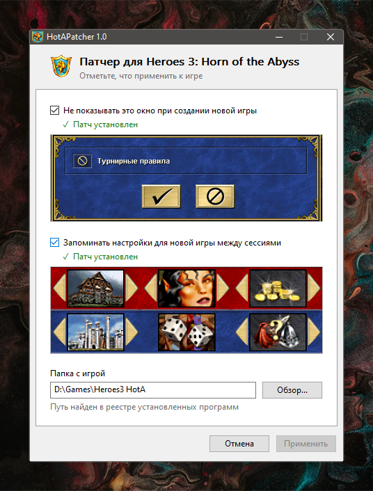

# &nbsp;HotAPatcher

Утилита патчит файлы игры [Heroes 3: Horn of the Abyss](https://h3hota.com), чтобы упростить запуск новой сессии на случайной карте.

## Зачем

Я играю в основном локальные сессии на случайных картах, и два момента меня раздражали.

**Окно «Турнирные правила»** появляется при каждой генерации карты, независимо от того, включены турнирные правила или нет. Отключить его нельзя ни твиками HD-мода, ни как-то ещё. Патч убирает этот лишний клик.

**Настройки новой игры не запоминаются**. Список городов приходится выставлять заново каждый раз. Полный случайный выбор мне не подходит, потому что есть города и их биомы, которые я не люблю. Пропатченная игра сохраняет выбранные город, героя и стартовый бонус при генерации новой игры в `HotA_Patcher.dat`. Можно безопасно удалить этот файл, тогда всё вернётся в состояние «Случайно».

## Как пользоваться

1. Убедиться, что игра не запущена.
2. Запустить `HotAPatcher.exe`, желательно от имени администратора.
3. Путь к игре подставится из реестра, если она была установлена. Иначе указать папку вручную.
4. Отметить нужные галочки и нажать «Применить».

Оригиналы файлов сохраняются рядом с расширением `.bak`. Когда оба патча сняты, файлы игры восстанавливаются из них.

## После обновления HD-мода

Обновление HotA может перезаписать `HD_HOTA.dll` и `h3hota.exe`, тогда патчи откатятся – в этом случае достаточно запустить патчер ещё раз. Место в коде ищется по сигнатуре, а не по фиксированному смещению, поэтому смена версии мода патчу не мешает.

Проверено на **HotA 1.8.0 + HD Mod 5.7 R33**.
